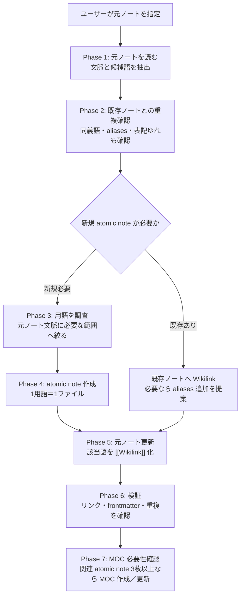

# AI運用指示書 — ユーザーの指示から atomic note を作成して Wikilink するワークフロー

## このファイルの位置づけ

- 配置: `~/Github/dotfiles/shared-references`。
- 役割: ユーザーからの依頼に基づいて atomic note を作成し、元ノート本文から `[[Wikilink]]` を貼るための運用仕様。
- 設計思想: 元ノートの文脈を壊さず、用語の説明だけを atomic note に外部化する。元ノートは本文の自然な箇所を `[[概念名]]` 化するだけに留め、説明の重複を増やさない。
- 必ず参照するファイル：
  - `vocabulary.md`：語彙（type / domain / tags / status の値）は `vocabulary.md` を単一の真実源とする。 値はそこから選び、無ければ追記をユーザーに提案する。`vocabulary.md` に追記した場合は変更済ファイルも併せて出力する。
  - `obsidian-rules.md`：Obsidian での運用においてトラブルを避けるための整形・命名・編集に関する規則
  - `atomic-template.md`：atomic note のテンプレート

---

## 0. ワークフロー全体



---

## 1. ユーザーからの依頼形式

ユーザーは次のいずれかの形で依頼する。

```markdown
このセッションの`<概念a>`と`<概念b>`について atomic note を作成してください。
```

```markdown
`<元ノートパス>` に出てくる `<用語>` について調べて atomic note を作成してください。
```

```markdown
`<元ノートパス>` の中で atomic note 化した方がよい用語を抽出してください。
```

```markdown
`<元ノートパス>` の未リンク用語を調べて atomic note 化してください。
```

用語が明示されている場合は、その用語を優先して処理する。用語が明示されていない場合は、AI は候補一覧を提示し、ユーザーが選ぶまで新規ノートを作成しない。

---

## 2. 各フェーズでの AI の役割

### Phase 1 — 元ノートを読む
- 元ノート全体を読み、該当語がどの文脈で使われているかを把握する。
- 用語だけでなく、前後の段落・論点・ユーザーの疑問を確認する。
- 元ノートの主題と異なる方向へ説明を広げすぎない。

### Phase 2 — 既存ノートとの重複確認
- `03_Atomic-notes` を中心に、同名・同義語・英日表記・略語・aliases を確認する。
- 既存ノートが使える場合は、新規作成せず、元ノートから既存ノートへ `[[Wikilink]]` を貼る。
- 既存ノートがあっても記述が適切でない場合や空の場合は、必要な情報を調査して追記した上で `[[Wikilink]]` を貼る。
- 既存ノートがあるが表記ゆれでリンクしにくい場合は、既存ノートの `aliases` 追加を提案する。ただし、ユーザーが明示的に許可した場合のみ既存ノートを編集する。
- 同一概念を別名で重複作成しない。

### Phase 3 — 用語を調査する
- 必要に応じて Web や公式ドキュメントを確認する。最新性が重要な用語、製品仕様、法律、規格、価格、人物、企業情報は必ず現在情報を確認する。
- 情報源を使った場合は、atomic note の本文または `source` に出自を残す。Web URL を使う場合は、本文中の自然な箇所に短く置くか、必要最小限の注記にする。
- 数学・物理・工学概念では、式・単位・変数・直感モデルを省略しない。数式にはノート内で通し番号を振る。

### Phase 4 — atomic note 作成
- `obsidian-rules.md` の規則を遵守。
- `atomic-template.md` をテンプレートに用いる。
- ユーザーから指定された概念またはユーザーが選んだ候補だけを、`03_Atomic-notes/<概念名>.md` として作成する。
- frontmatter は `atomic-template.md` に従う。
- `domain` / `tags` / `status` は `vocabulary.md` から選ぶ。
- `source` には元ノートへの `[[Wikilink]]` を入れる。Web など外部情報を使った場合は本文中に出典を補う。
- H1 とファイル名は同一にする。
- 1つの atomic note には1概念だけを書く。周辺概念は `related` または本文中の `[[Wikilink]]` で参照する。

### Phase 5 — 元ノートへ Wikilink を貼る
- 元ノート本文の該当語を、自然な範囲で `[[概念名]]` に置き換える。
- 表示語を変えたくない場合は `[[概念名|元の表記]]` を使う。
- 初出だけをリンクすることを原則とする。ただし、長いノートで読者が戻りにくい場合は、章ごとの初出にもリンクしてよい。
- 見出し、コードブロック、引用、URL、frontmatter 内は原則として置換しない。
- 元ノートに説明を追記しすぎない。詳しい説明は atomic note 側へ置く。

### Phase 6 — 検証
- 作成した atomic note のテキストが `obsidian-rules.md` に従っているか確認する。
- 作成した atomic note の frontmatter が `vocabulary.md` に従っているか確認する。
- ファイル名・H1・Wikilink が一致しているか確認する。
- 本文および frontmatter に、現在のノート自身や同一ノート内の見出し・ブロックをリンク先にした自己参照 Wikilink がないか確認する。
- 元ノートからリンクが解決できる形になっているか確認する。
- 既存ノートとの重複がないか再確認する。
- 変更ファイル一覧と、作成・更新したリンクをユーザーに報告する。

### Phase 7 — MOC 必要性確認
- 作成・更新した atomic note と同一トピックに属する既存 atomic note を確認する。
- 関連 atomic note が 3枚以上ある場合は、`moc-workflow.md` に従って既存 MOC を更新する。既存 MOC がなければ MOC 作成の対象にする。
- MOC を作らないのは、関連 atomic note が 2枚以下、または 3枚あっても同一トピックとして束ねる関係が薄いなどの特殊な場面に限る。その場合は理由を明示する。
- MOC の群分けや図の方針が大きな構成判断になる場合は、`obsidian-moc` スキルのヒューマンゲートに従い、草案を提示してユーザーの合意を取る。

---

## 3. 候補提示が必要な場合

用語が指定されていない場合、AI は次の形式で候補を提示し、ユーザーに番号指定を求める。

```markdown

## 4. atomic note 化候補

### 1. [[候補概念A]]
- 理由: <このノートから外部化するとよい理由>
- 元ノート内の文脈: <どの段落・論点で出たか>
- 既存ノート: <なし / あり: [[既存ノート名]]>
- 推奨: <新規作成 / 既存リンク / 見送り>

### 2. [[候補概念B]]
- 理由: ...
- 元ノート内の文脈: ...
- 既存ノート: ...
- 推奨: ...
```

候補提示後は「どの番号を atomic note 化しますか」と尋ねてターンを終える。ユーザーの番号指定が来るまで新規ノートを作成しない。

---

## 5. 作成ルール

### 構造ルール
- 1概念＝1ファイル。
- distill や元ノートは文脈、atomic note は概念説明を担当する。
- 本文の趣旨は概念の理解を助けることであり、それ以外の概念の説明は控えた上で必要に応じて `[[概念名]]` の形でリンクする。ただし、当該概念の理解や全体像の把握を担う説明を膨らませることに制限はない。例えば、Wikipediaにおいて「アメリカ合衆国」の説明が長大なのはこの概念が多岐に亘る要素を含むからであり、それらを省略することはこのルールの意図するところではない。
- 本文には「## 関連」「## 参照」セクションを作らない。構造的な関係は frontmatter の `up` / `related` / `source` に記述する。
- 概念の理解に必要となりそうな用語について、他のノートがある場合は `[[概念名]]` の形でリンクする。リンク先として適切なノートがない場合は、未解決リンクを作らず候補として残す。
- 説明の重複を避ける。すでに別ノートで説明済みの概念は、そのノートへ `[[概念名]]` の形でリンクする。
- 現在のノート自身への Wikilink は作らない。本文中で自身の概念名に言及するときは通常のテキストにする。
- 関連 atomic note が3枚以上ある同一トピックでは MOC を作成／更新する。MOC を作らないのは、関連 atomic note が2枚以下、または3枚あっても同一トピックとして束ねる関係が薄いなどの特殊な場面に限る。

### Properties 設計
- キー・値は英語小文字（kebab-case）。
- `domain` は concept では単一・必須。適したdomainが見当たらない場合は、ユーザーに新しい候補domainを数種類提示し、vocabulary.mdへの追加許可を尋ねる。
- `tags` は多値・任意だが、vocabulary.mdからなるべく付与するようにする。
- `status` は concept では `seedling` / `growing` / `evergreen`。
- `created` は本日の日付を記載。
- `up` / `related` / `source` がリンク構造を担う。
- `aliases` には別名・略語・和英表記・読みを置く。

### 命名規約
- atomic note のタイトルは、文中に `[[タイトル]]` と置いて読める短い名詞句にする。
- `obsidian-rules.md` に従う。

---


## 6. 元ノート更新例

### 置換前

```markdown
ObsidianではWikilinkを使うと、ノート同士の関係を後から辿りやすくなる。
```

### 置換後

```markdown
Obsidianでは[[Wikilink]]を使うと、ノート同士の関係を後から辿りやすくなる。
```

表示語を維持したい場合:

```markdown
Obsidianでは[[Wikilink|内部リンク]]を使うと、ノート同士の関係を後から辿りやすくなる。
```

---

## 7. 完了報告の形式

作業後、AI は次を簡潔に報告する。

```markdown
作成しました。

- 新規: `03_Atomic-notes/<概念名>.md`
- 更新: `<元ノートパス>`
- リンク: `<元の表記>` → `[[<概念名>]]`
- 確認: frontmatter / H1 / ファイル名 / 既存重複を確認済み
```

既存ノートを再利用した場合:

```markdown
新規作成せず、既存ノートへリンクしました。

- 既存: `03_Atomic-notes/<既存概念名>.md`
- 更新: `<元ノートパス>`
- リンク: `<元の表記>` → `[[<既存概念名>]]`
```
