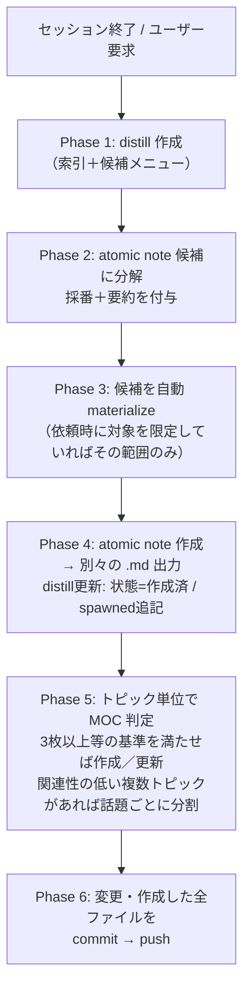

# AI運用指示書 — distill → atomic note 分解ワークフロー

## このファイルの位置づけ

- 配置: `~/Github/dotfiles/shared-references`。
- 役割: distill 作成と atomic note 分解の手順、および関連テンプレートをまとめた運用仕様。
- 設計思想: 「このセッションをdistillしてください」等の一般的な依頼では、AI が候補の採番・要約提示から materialize・MOC 作成・commit/push までを一気通貫で自動実行する。候補提示自体は省略せず distill の索引・出自記録として残すが、材料の可否をユーザーに確認して待つステップは置かない。ユーザーが依頼時に対象概念やスコープ（例:「〜と〜についてdistillして」）を明示した場合は、その範囲に限定する。
- 必ず参照するファイル：
  - `vocabulary.md`：語彙（type / domain / tags / status の値）は `vocabulary.md` を単一の真実源とする。 値はそこから選び、無ければ追記をユーザーに提案する。`vocabulary.md` に追記した場合は変更済ファイルも併せて出力する。
  - `obsidian-rules.md`：Obsidianでの運用においてトラブルを避けるための整形・命名・編集に関する規約。
  - `distill-template.md`：distill のテンプレート。
  - `atomic-template.md`：atomic note のテンプレート。

---

## 0. ワークフロー全体



既定ではユーザーの確認待ちを挟まない。AI は Phase 2 で候補を採番提示した後、そのまま Phase 3 に進んで全候補を materialize する。ユーザーが依頼時に対象概念やスコープを限定していた場合はその範囲のみを対象にする。

---
## 1. ユーザーからの依頼形式

ユーザーは次のいずれかの形で依頼する。

```markdown
このセッションをdistillしてください。
```

```markdown
このセッションの`<概念a>`と`<概念b>`についてdistillを作成してください。
```

## 2. 各フェーズでの AI の役割

### Phase 1 — distill 作成
- セッション終了時、またはユーザーからこのファイルを受け取った際に、`obsidian-rules.md` と `distill-template.md` に従って distill を1枚作る。
- distill は「索引＋候補メニュー」。知識本体は持たない。
- タイトル＝ファイル名は 元のチャットセッションのタイトルと同じにする（日付・"distill" を含めない。禁止記号は除去）。

### Phase 2 — atomic note 候補に分解
- セッション内容を 1概念＝1候補 の単位に分解する。
- 各候補に 通し番号（1, 2, 3, …） を振り、次を付ける: 番号付きの候補名（`[[候補名]]`。`obsidian-rules.md` のタイトル規約に従う＝短い名詞句）／2–4文の要約／出自（セッションのどの文脈か）／状態 = `未作成`。
- 候補一覧は distill の索引・出自記録として残すが、ユーザーに番号選択を尋ねてターンを終えることはしない。そのまま Phase 3 に進む。
- 概念が複数の候補にオーバーラップする場合、オーバーラップした部分を他のノートから `[[関連概念]]` の形で参照することで、同じ説明が複数のノートに記載されることを防ぐ。

### Phase 3 — 自動 materialize
- Phase 2 で提示した候補を、原則としてすべて materialize 対象にする。
- 例外: ユーザーが依頼時に対象概念やスコープを明示していた場合（例:「`<概念a>`と`<概念b>`についてdistillして」）は、その範囲の候補だけを対象にする。
- materialize 後にユーザーから対象の追加・除外の指示があれば、その回でその通りに追随する（初回の自動実行を妨げるものではない）。

### Phase 4 — atomic note 作成
- Phase 3 で対象とした候補を、`obsidian-rules.md` と `atomic-template.md` に従って 別々の .md ファイル として作成する。
- 内容は distill の要約を引き伸ばさない。`sources`（会話URL / 現セッション）に遡り、セッション履歴からフルに再構成する。
- 固有名詞の概念は [[二重角括弧]] で囲む。
- frontmatter は `atomic-template.md` と `vocabulary.md` に従う。
- 各 atomic note: `source: "[[この distill]]"`、`related` に隣接概念の `[[隣接概念]]`。
- 作成後、distill 側を更新する: 当該候補の状態を `作成済` に、候補名を解決リンクに、`spawned` に追記する。
- 作成した distill は `01_Distills` に、atomic note は `03_Atomic-notes` にそれぞれ保存する。同名のファイルが存在する場合は、新規に作成した md ファイルの名前を適切に変更した上で、その旨をユーザーに報告する。

### Phase 5 — MOC 判定・作成／更新
- §6「distill と MOC の役割分担」の基準に従い、トピックごとに MOC の要否を判断する。
- セッション内に相互の関連性が低い複数のトピックが含まれる場合は、トピックをまとめて1つの MOC に束ねず、話題ごとに分けて判定・作成／更新する。
- 作成する場合は `obsidian-moc` スキル（`moc-workflow.md`）に従う。ただし本パイプライン（distill からの自動実行）では `moc-workflow.md` Phase 2 の草案承認ヒューマンゲートは省略し、AI が群分けを判断して作成／更新したうえで、その内容を事後報告する。
- MOC を作らない場合は、関連 atomic note が2枚以下、または3枚あっても同一トピックとして束ねる関係が薄いなどの理由を明示する。

### Phase 6 — commit・push
- 今回のセッションで作成／更新したすべてのファイル（distill／atomic note／該当する場合は MOC・`vocabulary.md`）を git commit する。
- コミットメッセージには対象トピックと生成物の概要（例: 作成した distill・atomic note・MOC のファイル名）を含める。
- commit 後、リモートへ push する。vault のルート（ローカル実行環境の `~/Github/knowledge-base`、クラウド／リモート実行環境の GitHub リポジトリ `ikotera/knowledge-base`）については `obsidian-rules.md`「保存ディレクトリ」を参照。

---

## 6. distill と MOC の役割分担

distill と MOC（`obsidian-moc` スキル／`moc-workflow.md`）は**併用**する。見た目が似ていても担う軸が異なるため、統合せず役割を分ける。

| 軸 | distill | MOC |
|---|---|---|
| 主軸 | セッション（出自・時間） | トピック（領域・主題） |
| 個数 | 1セッション=1枚（増える） | 1トピック=1枚（育つ） |
| 寿命 | 作成時に確定し凍結（履歴） | 恒久・更新し続ける |
| 中身 | 候補メニュー＋出自＋`spawned` | 群別索引＋図＋全体像の語り |
| status | `draft` → `final` | `seedling` → `growing` → `evergreen` |
| 答える問い | これは**どこから**来たか | **どこへ**行けばよいか |

three層モデル: **distill（縦＝セッション軸）** → **atomic note（交点＝概念の単一の真実源）** → **MOC（横＝トピック軸）**。

### final になった概念は MOC へ委譲する
- distill の全候補が `作成済` になり `status: final` にしたら、**ナビゲーション（群別索引・図・全体像の語り）は MOC 側へ委譲**する。distill 冒頭に `> 成果の統合先: [[topic MOC]]` を置く。
- distill に残す固有価値は、候補ごとの**出自**と `date` / `ai` / `sources` / `spawned` という構造化メタデータ（＝「どこから来たか」の記録）。MOC と同じ索引を二重メンテしない。
- final にした distill の frontmatter に `moc: "[[topic MOC]]"` を追加し、委譲先を明示する（MOC 未作成なら省略）。

### MOC 作成基準
- MOC は乱立させないが、関連 atomic note が 3枚以上あるトピックでは恒久ハブとして作成／更新する。distill は 2枚以下の段階で暫定索引を兼ねる。
- 次のいずれかを満たしたら MOC を作成／更新する: 同一トピックに関連する atomic note が**3枚以上**ある／同一トピックに**2枚目の distill** が生まれた／**全体像の図**を持たせたくなった。
- MOC を作らないのは、関連 atomic note が 2枚以下、または 3枚あっても同一トピックとして束ねる関係が薄いなどの特殊な場面に限る。その場合は理由を明示する。
- MOC の作成・更新は `obsidian-moc` スキル（`moc-workflow.md`）に従う。MOC は複数の distill を `sources` で束ね、各 atomic note を群ごとに `[[Wikilink]]` で整理する。
- 1セッション（1 distill）内に相互の関連性が低い複数のトピックが含まれる場合は、それらを1つの MOC にまとめず、トピックごとに上記の作成基準を個別に判定し、該当するトピックごとに別々の MOC を作成／更新する。

---
