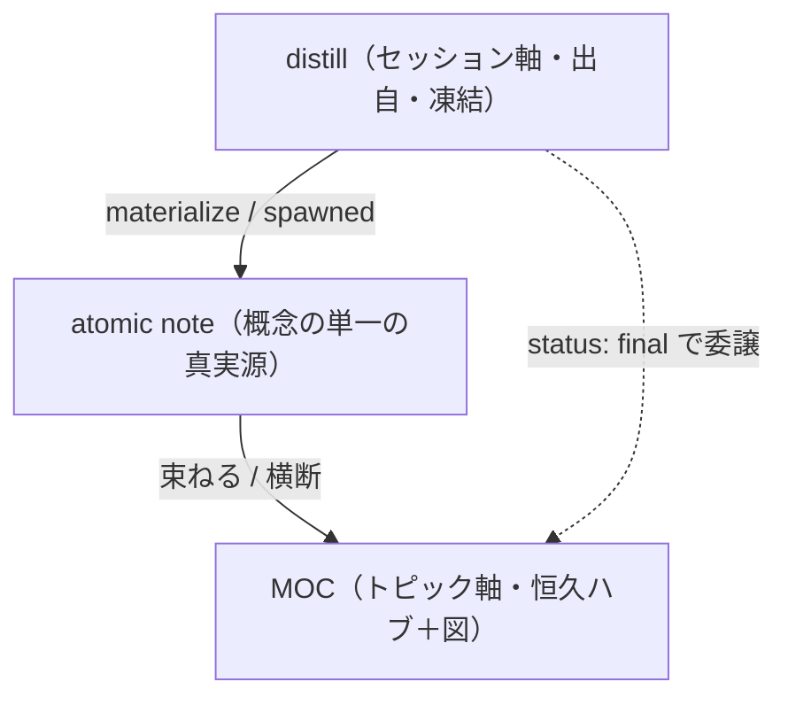

# AI運用指示書 — MOC（Map of Content）の作成・維持ワークフロー

## このファイルの位置づけ

- 配置: `~/Github/dotfiles/shared-references`。
- 役割: トピック（領域・主題）軸の恒久ハブ＝ MOC を作成・維持し、散在する atomic note を群ごとに束ねて「入口」を作るための運用仕様。
- 設計思想: MOC は概念の説明本体を持たない。説明は atomic note（単一の真実源）にあり、MOC は**群別索引＋全体像（図・語り）**に徹する。distill が「どこから来たか（出自・セッション軸）」を担うのに対し、MOC は「どこへ行けばよいか（主題・トピック軸）」を担う。
- 必ず参照するファイル：
  - `vocabulary.md`：語彙（type / domain / tags / status）の単一の真実源。値はそこから選び、無ければ追記をユーザーに提案する。`vocabulary.md` に追記した場合は変更済ファイルも併せて出力する。
  - `obsidian-rules.md`：整形・命名・編集・保存先の規約。MOC の保存先は `02_MOC`。
  - `moc-template.md`：MOC のテンプレート。
  - `distill-atomic-workflow.md`：distill と MOC の役割分担・final→MOC 委譲・MOC 作成基準。

---

## 0. distill / atomic note / MOC の関係



- distill と MOC は**併用**する。軸が違うため統合しない。
- atomic note は両者が指す実体。MOC も distill も説明本体を複製しない。

---

## 1. いつ MOC を作るか

MOC は乱立させないが、関連 atomic note が1つのトピック集合を形成する段階では早めに作る。distill は暫定索引にはなるが、関連 atomic note が 3枚以上あるトピックでは MOC を恒久ハブとして作成／更新する。次のいずれかを満たしたら作成／更新する。

- 同一トピックに関連する atomic note が **3枚以上**ある。
- 同一トピックに **2枚目の distill** が生まれた（複数セッションの統合が要る）。
- **全体像の図**を持たせたい／全体像の語りで個別ノートを橋渡ししたい。

MOC を作らないのは、関連 atomic note が **2枚以下**、または 3枚あっても同一トピックとして束ねる関係が薄いなどの特殊な場面に限る。その場合は「まだ MOC は不要」とだけ言わず、作らない理由を明示する。

---

## 2. ユーザーからの依頼形式

```markdown
`<トピック>` の MOC を作成してください。
```

```markdown
このトピックのノートが増えてきたのでハブ（MOC）にまとめてください。
```

```markdown
`<既存MOC>` に今回のノートを取り込んで更新してください。
```

```markdown
`<トピック>` の atomic notes を作成してください。
```

```markdown
このノートの未リンク用語について atomic notes を作成してください。
```

MOC への言及が無い atomic note 作成依頼でも、作成・更新後に同一トピックの関連 atomic note が **3枚以上**になる場合は、§1 の基準に従って MOC を作成／更新する。群分けや図の方針が大きな構成判断になる場合は、MOC 本体を確定する前に草案を提示してユーザーの合意を取る。

---

## 3. 各フェーズでの AI の役割

### Phase 1 — 対象ノードの収集
- 対象トピックに属する atomic note を `03_Atomic-notes` から洗い出す（同義語・aliases・英日表記ゆれも確認）。
- 関連する distill（`01_Distills`）を特定し、`sources` に束ねる候補とする。
- 既存 MOC があれば**新規作成せず更新**する。同一トピックの MOC を重複作成しない。

### Phase 2 — グルーピング設計（ヒューマンゲート）
- ノードを意味のある群（例: 構築／運用／トラブルシュート、入力／処理／出力 等）に分類した**草案**を提示する。
- 図を入れる場合は、何を図解するか（全体のデータフロー等）も提案する。
- 群分けと図の方針についてユーザーの合意を取ってから本体を作る。大きな構成判断を独断で確定しない。
- 例外: `session-distill-to-knowledge-base` スキルの自動パイプライン（distill → atomic note → MOC → commit/push を一気通貫で行う実行）から呼ばれる場合は、この事前承認ステップを省略する。AI が群分け・図の方針を判断して MOC を作成／更新し、その内容を事後報告する（詳細は `distill-atomic-workflow.md` の Phase 5 を参照）。それ以外の直接依頼では本ヒューマンゲートを維持する。

### Phase 3 — MOC 作成 / 更新
- `moc-template.md` と `obsidian-rules.md` に従い、`02_MOC/<トピック名>.md` を作成（または既存を更新）する。
- frontmatter は `vocabulary.md` の「キー定義（moc）」に従う：`type: moc` ／ `domain`（多値可）／ `tags` ／ `status`（`seedling`→`growing`→`evergreen`）／ `created` ／ `sources`（束ねた distill 群）／ `aliases`。
- 本文は群ごとに `[[ノード名]] — 一言の位置づけ` を並べる。説明本体は書かず atomic note へ委譲する。
- 図は `11_Images` に SVG を置き `![[ファイル名.svg]]` で名前埋め込み。ウィジェット依存の CSS 変数を使わず、ダークモード対応（`@media (prefers-color-scheme: dark)`）の自己完結 SVG にする。

### Phase 4 — distill 側の委譲処理
- 束ねた distill が `status: final` なら、その frontmatter に `moc: "[[この MOC]]"` を追加し、冒頭に `> 成果の統合先: [[この MOC]]` を置く。
- distill のナビ（群別索引・図）は MOC に委譲し、distill 側は出自記録に徹する（同じ索引を二重メンテしない）。

### Phase 5 — 検証
- 各 `[[Wikilink]]` が実在ノードに解決するか、群に漏れ・重複が無いかを確認する。
- 図の埋め込み（`![[...]]`）が解決するか確認する。
- frontmatter が `vocabulary.md` に従うか確認する。
- 取り込んだ distill の `moc` 委譲が済んでいるか確認する。
- 変更・作成ファイル一覧をユーザーに報告する。

---

## 4. 維持運用

- 新しい distill が同トピックの atomic note を生んだら、その都度 MOC の該当群へ `[[ノード]]` を追記し、`sources` に distill を足す。
- 群が肥大化したら細分化、または下位 MOC への分割を検討する（MOC から MOC を `[[Wikilink]]` で束ねてよい）。
- `status` はハブの充実度に応じて `seedling` → `growing` → `evergreen` と進める。

---

## 5. ハードルール

- MOC は概念の説明本体を持たない。説明は atomic note 側、出自は distill 側。MOC は群別索引＋全体像に徹する。
- 1トピック＝1 MOC。重複作成しない。
- 作成基準（§1）を満たしたら MOC を作成／更新する。基準を満たすのに作らない場合は、特殊事情を明示する。
- frontmatter のキー・値は `vocabulary.md` に従う（`type: moc` の値域、`sources` 多値）。
- `updated` は使わない（履歴は git が持つ）。
- 保存先は `02_MOC`、図は `11_Images`。
